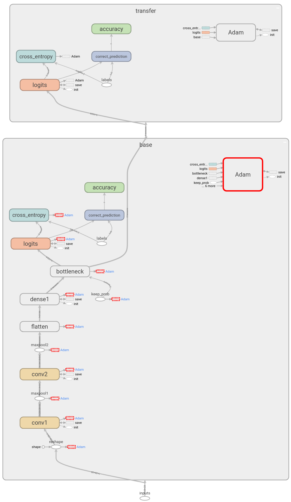

## Transfer Learning from Scratch
An exploration of the mechanics of transfer learning in `TensorFlow`.

### Introduction
This repo explores transfer learning in `TensorFlow` with a model that we made ourselves, on the familiar [MNIST](http://yann.lecun.com/exdb/mnist/) dataset.

The motivation for this notebook is to recreate the results of [Google's Transfer Learning tutorial](https://www.tensorflow.org/tutorials/image_retraining), but with an arbitarily-defined network of our own, rather than Inception v3 or Mobilenet, as Google provides for in their [`retrain.py` script](https://github.com/tensorflow/tensorflow/blob/master/tensorflow/examples/image_retraining/retrain.py).



### Installation
The preferred method for starting this notebook is to create a new environment in `conda`:

```
$ conda create --name TransferLearningYourself
$ source activate TransferLearningYourself
$ conda install pip
$ pip install -r requirements.txt
$ jupyter notebook 
```
